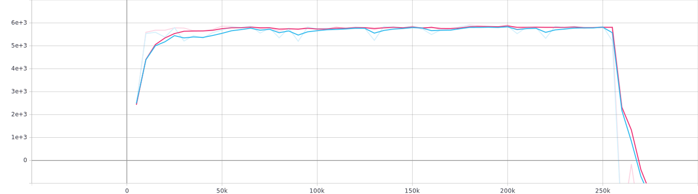
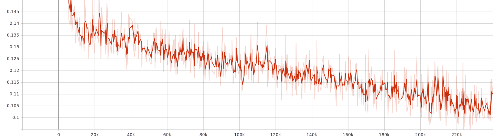
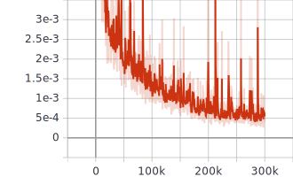

# chainer-bear

Reproduction codes of Bootstrapping Error Accumulation Reduction (BEAR) with chainer

## Prerequisites

install [chainer](https://github.com/chainer/chainer) and [tensorboardX](https://github.com/lanpa/tensorboardX) in prior of using the code

## How to train

### with gpu

$ python3 main.py --env="Ant-v2" --datafile=\<file to buffer path\> --gpu=\<gpu number\>

### without gpu

$ python3 main.py --env="Ant-v2" --datafile=\<file to buffer path\>

## Results

I tested only with Ant-v2 data and found that laplacian kernel is highly stable compared to gaussian kernel.  
However, both kernel succeeded learning similar policy that scores like the behavior policy used for gathering the training data. 

Below graphs are results of 1 training run for laplacian kernel.

### evaluation result

Policy performance suddenly decreses after 200k iterations.

### mmd loss

### vae loss

